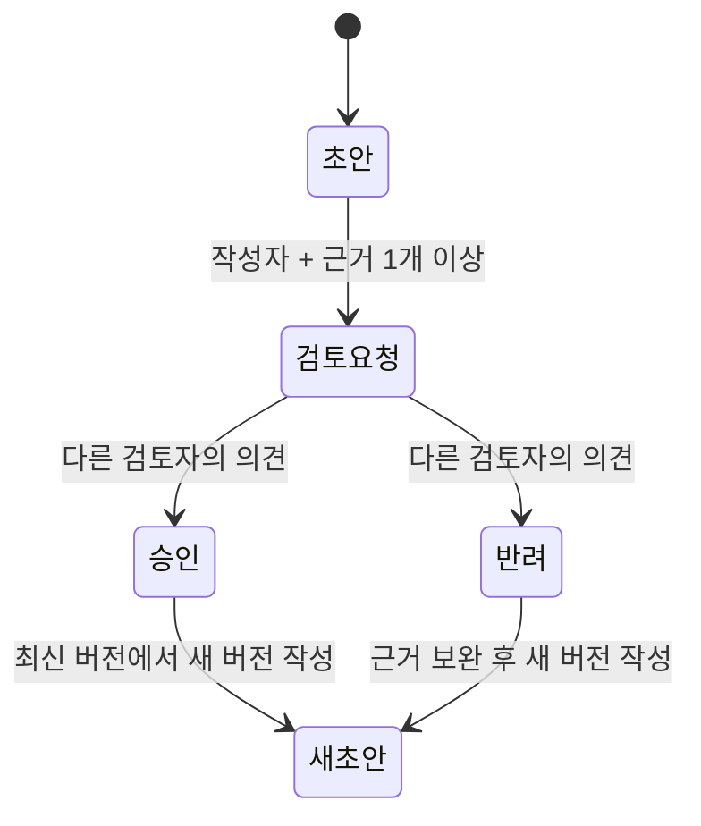

# WaferFlow Review 0.4 — 운영과 검증

## 현재 사용할 수 있는 범위

단일 조직의 소규모 공정 검토 파일럿을 위한 워크스페이스입니다. 레시피 버전과 실험 근거를 보관하고, 다른 구성원의 검토를 받는 흐름을 구현했습니다. 실제 고객사 배포, 보안 감사, 장시간 부하 검증, 공정 실측 보정은 아직 수행하지 않았습니다.

내장 12변수 레시피의 입력 범위·간격은 교육용 모델의 지원 범위입니다. 범위를 벗어난 실제 제조 레시피를 정규화해 강제로 저장하지 않고 오류를 반환합니다. 특정 회사의 실제 장비 레시피 스키마, MES, SECS/GEM, PDK, SSO를 지원한다는 의미가 아닙니다.

## 로컬 실행

Python 3.12 이상과 프로젝트 폴더에서 실행합니다.

```powershell
.\start-review.ps1
```

이미 의존성이 설치되어 있으면:

```powershell
.\.venv\Scripts\python.exe run_server.py
```

`http://127.0.0.1:8766/workbench.html`에서 첫 관리자 계정을 직접 만듭니다. 기본 계정은 없습니다. 최초 설정은 서버의 localhost에서만 가능합니다. 12–128자 비밀번호를 사용합니다. 최초 계정 이후에는 공개 가입을 받지 않고 관리자가 구성원을 등록합니다.

기존 포토 실험실은 `/photo-lab.html`에서 열 수 있습니다. 새 CMOS Fab 시뮬레이터는 `/` 또는 `/index.html`에서 열리며, 해당 실험은 브라우저 로컬 기록으로 별도 보관됩니다. 워크스페이스의 버전을 ‘3D 장비에서 확인’으로 열면 해당 조건을 불러옵니다. 변경한 조건은 ‘현재 조건으로 변경안 작성’을 눌러 별도 버전으로 저장합니다. 기존 브라우저 로컬 기록은 자동으로 서버에 업로드하지 않습니다.

**프로젝트 루트에서 `python -m http.server`나 디렉터리 전체를 공개하는 서버를 실행하지 마세요.** 운영 서버는 허용한 프런트엔드 파일만 제공하며 `.data`, 백업, Python 코드, 테스트 파일을 제공하지 않습니다.

## 팀 검토 흐름

1. 관리자가 ‘구성원 관리’에서 엔지니어와 검토자 계정을 만듭니다. 초기 비밀번호는 안전하게 전달하고 사용자가 자신의 비밀번호로 바꿉니다.
2. 엔지니어가 프로젝트와 레시피 r1을 작성합니다. 12개 조건, 모델 시나리오, 변경 이유를 기록합니다.
3. 본인의 초안에서 서버 시뮬레이션을 실행하거나 계측 CSV를 연결합니다. Lot ID와 출처를 반드시 입력합니다.
4. 원본 결과를 확인하고 검토를 요청합니다. 이 시점부터 조건과 근거 묶음을 추가·수정할 수 없습니다.
5. 다른 검토자 또는 관리자가 조건 차이와 근거를 확인하고 의견과 함께 승인·반려합니다. 관리자도 자신의 변경안은 판정할 수 없습니다.
6. 후속 수정은 최신 버전에서 새 초안을 만듭니다. 이전 버전과 실험 결과는 보존됩니다.



승인은 워크스페이스 내 변경안 검토 상태입니다. 전자서명 규제 준수, 품질 인증, 양산 출하 또는 장비 실행 권한은 아닙니다.

## 데이터와 재현성

| 데이터 | 보관 방식 | 해석 |
|---|---|---|
| 레시피 | 12개 조건, 모델 버전, 시나리오, 부모 버전, 작성자, UTC 시각 | 저장한 내용 수정 불가. 변경은 새 버전 |
| 서버 시뮬레이션 | 서버가 다시 계산한 결과, 시드, 모델 코드·카탈로그 해시 | 미보정 합성 모델 |
| 계측 CSV | 원본 행의 숫자·사이트, 파일 SHA-256, 출처, 입력 규격, 표본 통계 | 사용자가 제공한 미검증 계측 |
| 합성 CSV 예시 | 같은 CSV 검증을 거치며 `demo` 출처 유지 | 실제 계측 수량에서 제외 |
| 실험 결과 | 당시 JSON과 SHA-256을 고정 저장 | 이후 화면에서 재계산하여 덮어쓰지 않음 |
| 검토 | 상태, 검토자, 검토 의견, 시각, 충돌 확인 번호 | 동시 판정 시 오래된 요청은 409 |
| 변경 이력 | 서버의 추가 전용 이벤트 행 | DB 관리자에 대한 위변조 방지·외부 공증은 아님 |

프로젝트 목록에서는 결과 요약만 전송합니다. 실험 상세를 열 때 원본 사이트/다이를 가져오며 JSON 내보내기에는 전체 원본이 포함됩니다.

### CSV 형식

열 순서와 단위가 고정되어 있습니다. UTF-8, 최대 1 MB / 2,000행, `(wafer_id, site_id)` 조합이 고유해야 합니다.

```csv
wafer_id,site_id,cd_nm,etch_depth_nm
W01,CENTER,500,100
W01,EDGE-01,506,102
```

위 숫자는 **형식 설명을 위한 예시**입니다. 화면의 ‘합성 CSV 예시 채우기’는 데이터 유형도 합성 예시로 바꿉니다. 사용자 제공 계측은 장비·파일명·기록 번호 등 출처를 입력합니다.

CD 표준편차는 표본 표준편차(`n-1`)이며 한 행이면 미정으로 표시합니다. 규격 충족 비율은 입력한 CD 상·하한 안에 드는 사이트의 관측 비율입니다. 웨이퍼 수율이나 Cpk가 아닙니다. 사이트 순서 차트는 시간 관리도가 아니며 공정 안정성을 판정하지 않습니다.

## 저장과 백업

기본 DB: 프로젝트의 `.data/waferflow.sqlite3`. `WF_DATABASE` 환경변수로 서버의 다른 경로를 지정할 수 있습니다. SQLite WAL을 사용하므로 운영 중 DB 파일 하나만 복사해서 백업하지 않습니다. 일관된 스냅샷을 만드는 SQLite Backup API를 사용합니다. ([SQLite 공식 안내](https://www.sqlite.org/backup.html))

```powershell
.\.venv\Scripts\python.exe -m server.backup --output .data\backups\review-2026-09-18.sqlite3
```

백업은 새 파일에만 쓰며 무결성과 외래 키를 검사합니다. 파일에는 사용자 비밀번호 해시와 세션 레코드도 포함되므로 서버 관리자만 읽을 수 있는 위치에 보관합니다. 프로젝트 JSON 내보내기는 프로젝트 조건·결과·검토 이력용이며 계정 정보는 포함하지 않습니다.

복원 시 서버를 중지하고, 검증한 백업을 별도의 새 DB 파일로 복사한 다음 `WF_DATABASE`를 그 파일로 지정해 시작합니다. 기존 DB를 덮어쓰지 않고 로그인·프로젝트·원본 결과를 확인한 뒤 사용 경로를 전환합니다. 새 서버 전환 시 백업 시점의 세션을 폐기하려면 서버를 중지한 상태에서 `sessions` 테이블을 비웁니다. 보존 기간·백업 주기·복원 담당자는 조직에서 정해야 합니다.

## 사내 서버 배포 전 결정할 항목

- 기본 실행은 localhost에만 바인딩합니다. 회사 네트워크에 공개하려면 HTTPS reverse proxy, 접근 가능한 호스트 이름, `WF_ALLOWED_HOSTS`, `WF_COOKIE_SECURE=1`을 설정합니다. 단순히 `0.0.0.0`으로 바꾸어 공개하지 않습니다.
- Flask 개발 서버 대신 Waitress로 실행합니다. ([Flask의 Waitress 배포 안내](https://flask.palletsprojects.com/en/stable/deploying/waitress/))
- TLS 프록시가 원래 Host와 HTTPS scheme을 신뢰 가능한 방식으로 WSGI에 전달하도록 구성해야 합니다. 현재 실행 스크립트는 프록시 헤더를 무조건 신뢰하지 않습니다. 해당 구성 검증 없이 원격 배포 완료로 간주하지 않습니다.
- HttpOnly/SameSite 세션, 변경 요청의 CSRF 토큰·Origin 확인, 로그인 시도 제한, 역할 검증, 비활성 계정 세션 회수를 구현했습니다. 설정의 기준은 [Flask 보안 안내](https://flask.palletsprojects.com/en/stable/web-security/)를 참고했습니다. 외부 침투 테스트나 보안 인증을 받은 상태는 아닙니다.
- 모든 계정은 같은 조직의 전체 프로젝트를 열람합니다. 프로젝트별 접근 통제·SSO·MFA·다중 조직 격리가 필요한 환경에는 해당 기능을 먼저 추가해야 합니다.
- 회사의 실제 레시피 항목/단위, 계측 내보내기 형식, 장비 식별 체계, 검토 책임, 데이터 보존 정책을 확인해야 합니다. 내장 모델을 제조 예측에 사용하려면 별도의 실측 보정과 외부 검증이 필요합니다.

## 검증

```powershell
.\.venv\Scripts\python.exe -m unittest discover -s tests -p test_review.py -v
```

서버·모델 검증 21개: 권한·CSRF·Host, 최초 계정, 레시피 검증, 서버 재계산, 원본 보존, 동시 수정, 자기 승인 금지, 검토 근거 고정, CSV, 내보내기, 백업 복원, 세션 회수 등. 브라우저 모델의 12개 기준 조건에서 서버의 528개 다이 결과와 비교합니다.

기존 모델·DOM·Three.js 검증은 `tests/run-tests.mjs`의 `runTests(rootPath)`로 실행합니다. 3D 연결 포함 39개입니다.

`tests/review-ui.mjs`의 `runReviewUITests(rootPath)`는 **별도 테스트 DB를 사용한 8767 포트 서버**에 연결합니다. 실제 HTTP 요청과 DOM 이벤트로 최초 설정→작성→실험→다른 계정의 승인을 확인하며 11개가 통과했습니다. 운영 서버/실제 데이터에는 실행하지 않습니다. Node.js가 설치되어 있다면 다음처럼 별도 PowerShell 창에 테스트 서버를 실행한 후 테스트 함수를 호출할 수 있습니다.

```powershell
$env:WF_DATABASE = Join-Path (Get-Location) '.data\ui-test.sqlite3'
.\.venv\Scripts\python.exe run_server.py --port 8767
```

```powershell
node --input-type=module -e "import('./tests/review-ui.mjs').then(async m => console.log(await m.runReviewUITests(process.cwd())))"
```

테스트 결과: 총 **71개**. 실제 브라우저 레이아웃·GPU 렌더링, 고객사 실측 정확도, 다중 사용자 부하·장기 운용은 이 검증에 포함되지 않습니다. 현재 도구 환경에서 브라우저 연결/화면 캡처를 사용할 수 없어 시각 검증은 완료하지 못했습니다.
